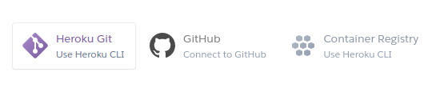

# Exhange Rate Line Bot

I am a **Traditional Chinese** exchange rate Line bot.

## Requirements

- [Python 3](https://www.python.org/download/releases/3.0/)
- [Line Developers](https://developers.line.biz/)
- [MongoDB](https://www.mongodb.com/)
- [Heroku](https://www.heroku.com/)

## Deployment

Step 1. Open **main.py** and modify the two main variables provided by **Line Developers**

	line_bot_api = LineBotApi('YOUR_CHANNEL_ACCESS_TOKEN')
	handler = WebhookHandler('YOUR_CHANNEL_SECRET')

Step 2. Open **preferences.py** and modify a main variable

	self.client = MongoClient("YOUR_MONGODB_CONNECTION_STRING")
	
Step 3. Choose one of deployment methods provided by **Heroku** and follow its instructions

Step 4. Add your LINE bot as a friend - enjoy it!

## Troubleshooting

- Q: Heroku logs show "at=error code=H14 desc="No web processes running"
- A: Enter the following command:

      heroku ps:scale web=1

## Exchange rate data source

- [即匯站](https://tw.rter.info/)
